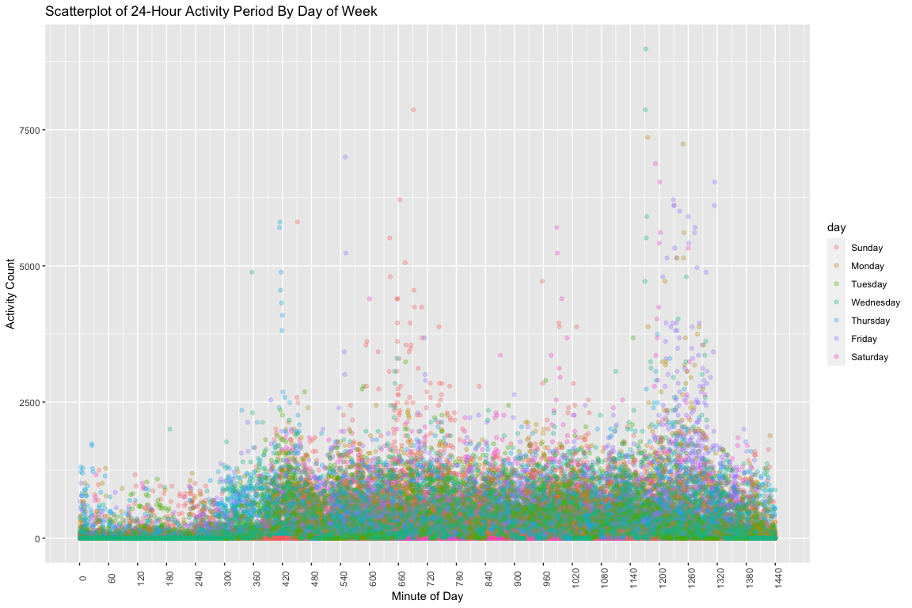

p8105_hw3_af3341
================
Alana Ferris
2022-10-07

``` r
library(tidyverse)
library(dplyr)
library(patchwork)
knitr::opts_chunk$set(fig.width = 12, fig.height = 8) 
```

# Problem 1

``` r
library(p8105.datasets)
data("instacart")
```

## Dataset Description

The `instacart` dataset contains 1384617 observations of individual
products from different instacart orders. There are 15 total variables
in this dataset describing order information, product information, and
customer information, which are listed below. For example, in
observation row 1027, the customer ordered concentrated homestyle
chicken stock which we can also see they have never ordered before
because of the value of 0 in the `reordered` column. We also know this
item was found in the canned goods department in aisle 69. One could
keep reading the values in the different columns for more information on
this product.

-   `order_id`: order identifier
-   `product_id`: product identifier
-   `add_to_cart_order`: order in which each product was added to cart
-   `reordered`: 1 if this product has been ordered by this user in the
    past, 0 otherwise
-   `user_id`: customer identifier
-   `eval_set`: which evaluation set this order belongs in
-   `order_number`: the order sequence number for this user (1=first,
    n=nth)
-   `order_dow`: the day of the week on which the order was placed
-   `order_hour_of_day`: the hour of the day on which the order was
    placed
-   `days_since_prior_order`: days since the last order, capped at 30,
    NA if order_number=1
-   `product_name`: name of the product
-   `aisle_id`: aisle identifier
-   `department_id`: department identifier
-   `aisle`: the name of the aisle
-   `department`: the name of the department

## Questions

### How many aisles are there and which aisles are the most items ordered from?

``` r
distinct_aisle_df = instacart %>% 
  group_by(aisle, aisle_id) %>% 
  distinct() %>% 
  summarize(
    n_obs = n()
  )
```

There are 134 aisles, of which `aisle_id` 83 and 24 (fresh vegetables
and fresh fruits respectively) are the most ordered from. They both have
over 150,000 orders each.

### Plot of number of items ordered in each aisle

``` r
grouped = instacart %>% 
  group_by(aisle) %>% 
  summarize(aisle_count = n()) %>% 
  filter(aisle_count > 10000)

  ggplot(grouped, aes(x = (reorder(aisle, aisle_count)), y = aisle_count)) +
    geom_bar(stat = "identity") + 
      labs(
    x = "Aisle",
    y = "Number of Items Purchased",
    title = "Barplot of the most popular Instacart aisles") + 
    viridis::scale_color_viridis(
    name = "Aisle", 
    discrete = TRUE) + 
    coord_flip()
```

<!-- -->

### Table for three most popular items in each of the aisles “baking ingredients”, “dog food care”, and “packaged vegetables fruits”

``` r
three_aisles = instacart %>% 
  group_by(aisle, product_name) %>% 
  summarize(aisle_count = n()) %>% 
  filter(aisle == "baking ingredients" | aisle == "dog food care" | aisle == "packaged vegetables fruits") %>% 
  arrange(desc(aisle_count)) %>% 
  slice(1:3)

three_aisles
```

    ## # A tibble: 9 × 3
    ## # Groups:   aisle [3]
    ##   aisle                      product_name                                aisle…¹
    ##   <chr>                      <chr>                                         <int>
    ## 1 baking ingredients         Light Brown Sugar                               499
    ## 2 baking ingredients         Pure Baking Soda                                387
    ## 3 baking ingredients         Cane Sugar                                      336
    ## 4 dog food care              Snack Sticks Chicken & Rice Recipe Dog Tre…      30
    ## 5 dog food care              Organix Chicken & Brown Rice Recipe              28
    ## 6 dog food care              Small Dog Biscuits                               26
    ## 7 packaged vegetables fruits Organic Baby Spinach                           9784
    ## 8 packaged vegetables fruits Organic Raspberries                            5546
    ## 9 packaged vegetables fruits Organic Blueberries                            4966
    ## # … with abbreviated variable name ¹​aisle_count

### Table showing the mean hour of the day at which Pink Lady Apples and Coffee Ice Cream are ordered

``` r
mean_hour = instacart %>% 
  group_by(product_name, order_dow, order_hour_of_day) %>% 
  mutate(order_dow = recode(order_dow, `0` = "Sunday", `1` = "Monday", `2` = "Tuesday", `3` = "Wednesday", `4` = "Thursday", `5` = "Friday", `6` = "Saturday")) %>% 
  filter(product_name == "Pink Lady Apples" | product_name == "Coffee Ice Cream") %>% 
  select(product_name, order_dow, order_hour_of_day) %>% 
  group_by(product_name, order_dow) %>% 
  summarize(
    mean_hour_of_day = mean(order_hour_of_day, na.rm = TRUE)) %>% 
  pivot_wider(
    names_from = "order_dow",
    values_from = "mean_hour_of_day"
  ) %>% 
  select(Sunday, Monday, Tuesday, Wednesday, Thursday, Friday, Saturday)

mean_hour
```

    ## # A tibble: 2 × 8
    ## # Groups:   product_name [2]
    ##   product_name     Sunday Monday Tuesday Wednesday Thursday Friday Saturday
    ##   <chr>             <dbl>  <dbl>   <dbl>     <dbl>    <dbl>  <dbl>    <dbl>
    ## 1 Coffee Ice Cream   13.8   14.3    15.4      15.3     15.2   12.3     13.8
    ## 2 Pink Lady Apples   13.4   11.4    11.7      14.2     11.6   12.8     11.9

# Problem 2

## Tidying the accel_data

``` r
accel_data = read_csv('data/accel_data.csv') %>% 
  janitor::clean_names() %>% 
  pivot_longer(
    activity_1:activity_1440, 
    names_to = "minutes", 
    values_to = "count", names_prefix = "activity_") %>% 
  mutate(day_type = recode(day, "Monday" = "weekday", "Tuesday" = "weekday", "Wednesday" = "weekday", "Thursday" = "weekday", "Friday" = "weekday", "Saturday" = "weekend", "Sunday" = "weekend")) %>% 
  mutate(day = factor(day, levels = c("Sunday", "Monday", "Tuesday", "Wednesday", "Thursday", "Friday", "Saturday")), day_type = factor(day_type)) %>% 
  mutate_at(c("minutes"), as.numeric)
```

## Dataset Description

The `accel_data` dataset contains 50400 observations of activity count
during a 24 hour period for a 63 year old male over 35 days. There are 6
total variables in this dataset, which include the `week` of
observation, the `day_id` (day of the week), and the value given to the
activity occurring each minute of the day, called `count`. There is also
a `day_type` variable, which lists if the activity happened on a weekday
or weekend. The resulting dataset has the above-described dimensions:
54000 rows x 6 columns.

## Total Activity Over the Day

``` r
total_activity = 
  accel_data %>% 
  group_by(day) %>% 
  summarize(total_activity = sum(count))

total_activity
```

    ## # A tibble: 7 × 2
    ##   day       total_activity
    ##   <fct>              <dbl>
    ## 1 Sunday          1919213 
    ## 2 Monday          1858699.
    ## 3 Tuesday         1799238.
    ## 4 Wednesday       2129772.
    ## 5 Thursday        2091151.
    ## 6 Friday          2291711.
    ## 7 Saturday        1369237

Wednesdays, Thursdays, and Fridays have the highest activity counts out
of all of the days of the week. Saturday has the lowest activity count

## Plot of 24-Hour Activity Time on Each Day

``` r
accel_data %>%  
  group_by(day, minutes) %>% 
  ggplot(aes(x = minutes, y = count, color = day)) + 
  geom_point(alpha = 0.3) + 
  theme(axis.text.x = element_text(angle = 90)) +
  scale_x_continuous(breaks = seq(from = 0, to = 1440, by = 60)) +
   labs(
    x = "Minute of Day",
    y = "Activity Count",
    title = "Scatterplot of 24-Hour Activity Period By Day of Week")
```

<!-- -->

As can be seen in the scatterplot, the majority of activity counts over
a 24 hour period during the 35 days of observation fall below 2500.
However, there are 4 distinct peaks where activity count is much higher
than normal. The first peak occurs around minute 420, which is around
the 7th hour of the day. This spike in activity is associated with
Thursdays, one of the 63-year-old man’s most active days. The next
activity peak occurs between minutes 540 and 780, or 9:00AM and 1:00PM.
Here we can see a couple of Fridays and Sundays where the activity count
went much higher than normal. The third peak is around minute 1020,
5:00PM, which is made up of Saturdays and Sundays. It is interesting
Saturday is in this peak because it is the man’s lowest activity day on
average. The final peak is made up of mostly Fridays and Wednesdays,
with the activity happening between 7:00PM and 10:00PM (minutes 1140 to
1320). This is expected because Fridays and Wednesdays are 2 of his 3
highest activity days on average.

# Problem 3

``` r
library(p8105.datasets)
data("ny_noaa")

ny_noaa_tidy = ny_noaa %>% 
  janitor::clean_names() %>% 
  separate(date, into = c("year", "month", "day"),  sep = "-", convert = TRUE) %>% 
  mutate(
    year = as.numeric(year), 
    month = as.numeric(month), 
    day = as.numeric(day), 
    prcp = as.numeric(prcp), 
    snow = as.numeric(snow), 
    snwd = as.numeric(snwd), 
    tmax = as.numeric(tmax), 
    tmin = as.numeric(tmin),
    prcp = prcp/10,
    tmax = tmax/10,
    tmin = tmin/10) 
```

## Dataset Description

The `ny_noaa_tidy` dataset contains 2595176 daily observations of
weather data captured at NY weather stations between January of 1981 to
December of 2010. There are 9 total variables in this dataset, which
include the date of observation, the weather station id `id`, the levels
of precipitation (`prcp`) and/or snowfall and snow depth (`snow`/`snwd`)
in millimeters. There is also data for the maximum and minimum
temperatures on that date of observation, `tmax` and `tmin`.The
resulting dataset has the above-described dimensions: 2595176 rows x 9
columns. Because about half of the stations report precipitation only,
and there is a lot of variability in record length, one should use
caution when making comparisons between stations. We can mitigate this
issue by dropping the cells without values so as to only draw
comparisons between similar observations.

## Most Common Snowfall Values

``` r
most_snow_values = ny_noaa_tidy %>% 
  group_by(snow) %>% 
  distinct() %>% 
  summarize(
    n_snow = n()
    )
```

The most common snowfall value is 0mm of snow. This makes sense because
the majority of days in New York it does not snow. The second most
common value is an “NA” because half of the stations do not report on
anything other than precipitation (rain). So it makes sense that the
second most common snowfall value we see is no value. Of the actual
observations of snowfall, 25mm is the most commonly observed amount of
snowfall.

## Average Max Temperature Plot

``` r
avg_tmax = 
  ny_noaa_tidy %>% 
  group_by(month, year, id) %>% 
  filter(month == '1' | month == '7') %>% 
  mutate(month = recode(month, `1` = "January", `7` = "July")) %>% 
  summarize(
    mean_tmax = mean(tmax, na.rm = TRUE))
  
  avg_tmax %>% 
    ggplot(aes(x = year, y = mean_tmax, group = id)) + 
    geom_line(alpha = 0.3) + 
    facet_grid(. ~ month)
```

<!-- -->

It is easy to see that July, between 1981 and 2010, has higher average
maximum temperatures than January does between these same years. The
plot indicates some outliers. For January, there are a couple stations
that observed much warmer or colder temperatures than normal, upwards of
10 degrees celsius in January or as low as -15 degrees celsius. For
July, there are also some outlier stations that recorded much warmer or
cooler temperatures than normal, like 35 degrees celsius or 15 degrees
celsius.

## Tmax v Tmin and Snowfall for Full Dataset

``` r
temps = ny_noaa_tidy %>% 
  group_by(year, month, day) %>% 
  drop_na(tmax, tmin)

hex_plot = temps %>% 
  ggplot(aes(x = tmin, y = tmax)) +
  geom_hex() + 
  labs(
    x = "Minimum Temp (C)",
    y = "Maximum Temp (C)",
    title = "Hexogram plot of all NY weather observations 1981-2010 (tmax vs. tmin)")

snowfall = 
  ny_noaa_tidy %>% 
  group_by(snow, year) %>% 
  filter(between(snow, 0, 100)) %>% 
  drop_na(snow) %>% 
  mutate(year = as.character(year))

snowfall_plot = 
  snowfall %>% 
  ggplot(aes(x = year, y = snow)) +
  geom_violin() + 
  theme(axis.text.x = element_text(angle = 90)) + 
  labs(
    x = "Year",
    y = "Snowfall (mm)",
    title = "Violin plot of NY snowfall observations between 0-100mm")

hex_plot + snowfall_plot
```

<!-- -->
